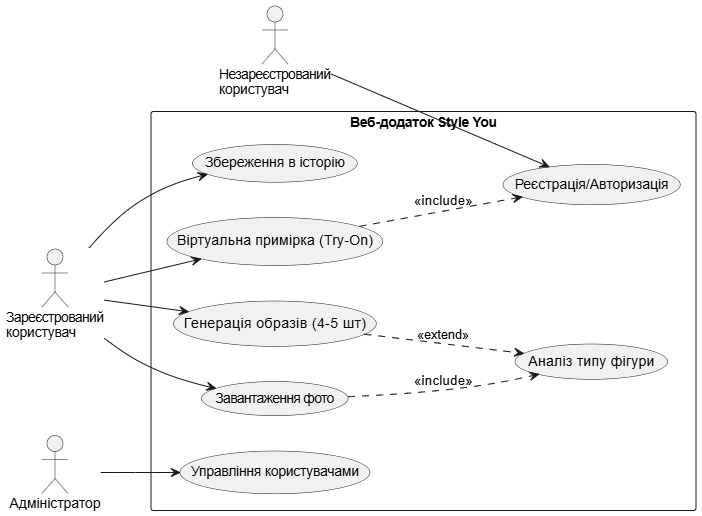
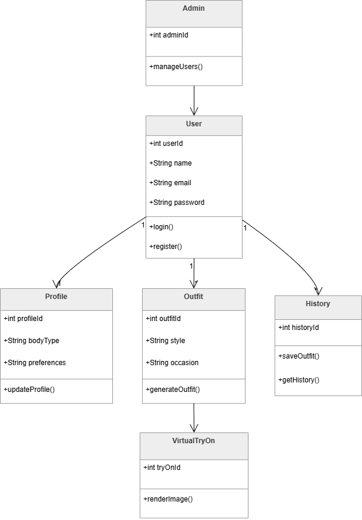

# Лабораторна робота №2
**Тема:** Моделювання програмної системи засобами UML (Unified Modeling Language)
**Проєкт:** Веб-додаток Style You

---

## Крок 1-2. Функціональні вимоги (Functional Requirements)
На основі специфікації вимог (SRS) визначено наступні ключові функції системи:

* **FR-01 [Must]:** Система повинна дозволяти користувачу зареєструватися та авторизуватися.
* **FR-02 [Must]:** Система повинна аналізувати тип фігури користувача на основі завантаженого фото та біометричних даних.
* **FR-03 [Must]:** Система повинна генерувати 4-5 повноцінних варіантів образів під обрану користувачем подію.
* **FR-04 [Must]:** Система повинна забезпечувати функцію віртуальної примірки (Virtual Try-On), генеруючи зображення користувача в обраному одязі.
* **FR-05 [Must]:** Система повинна мати особистий кабінет (Profile) для управління даними та збереження історії згенерованих образів.

---

## Крок 3. Діаграма прецедентів (Use Case Diagram)


---

## Крок 4. Діаграма класів (Class Diagram)


---

## Крок 5. Діаграма послідовності (Sequence Diagram)
**Ключовий сценарій:** Віртуальна примірка та генерація образів (реалізація вимог FR-03, FR-04).

```mermaid
sequenceDiagram
    actor U as Зареєстрований користувач
    participant S as :System (Style You)
    participant AI as :AI Model (Computer Vision)
    participant DB as :Database

    U->>S: Вибирає подію та натискає "Згенерувати образи"
    S->>DB: Запитує завантажене фото та BodyProfile
    DB-->>S: photoData, bodyShape
    S->>AI: requestGenerateLooks(bodyShape, eventType)
    
    Note over AI: ШІ генерує 4-5 варіантів одягу
    AI-->>S: List~Outfit~
    S-->>U: Відображає варіанти одягу
    
    U->>S: Натискає "Приміряти (Try-On)" на обраному луці
    S->>AI: requestVirtualTryOn(photoData, selectedOutfit)
    
    Note over AI: ШІ рендерить одяг на фото (до 30 сек)
    AI-->>S: resultImageUrl
    
    S->>DB: saveSessionHistory(resultImageUrl)
    S-->>U: Відображає готовий результат примірки
