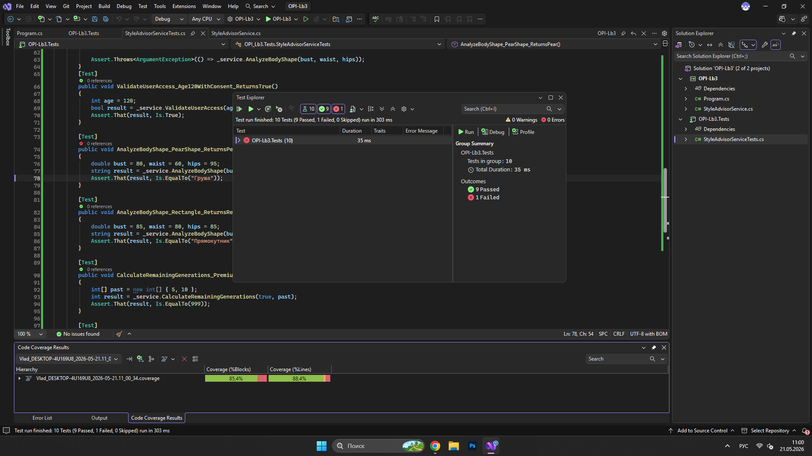

# Лабораторна робота №3
**Тема:** Модульне тестування програмного забезпечення
**Мета:** Набути навичок розробки модульних тестів (Unit Tests) з використанням сучасних фреймворків тестування, застосування технік проєктування тестів (EP, BVA) та аналізу покриття коду.

---

## 1. Вихідний код реалізованого модуля

```csharp
using System;

namespace OPI_Lb3
{
    public class StyleAdvisorService
    {
        // Метод 1: Аналіз типу фігури (логіка з розгалуженням та винятками)
        public string AnalyzeBodyShape(double bust, double waist, double hips)
        {
            if (bust <= 0 || waist <= 0 || hips <= 0)
                throw new ArgumentException("Усі параметри мають бути більшими за нуль.");

            if (bust > 300 || waist > 300 || hips > 300)
                throw new ArgumentOutOfRangeException("Параметри перевищують фізіологічні норми.");

            double bustWaistRatio = bust / waist;
            double hipsWaistRatio = hips / waist;

            if (bustWaistRatio >= 1.25 && hipsWaistRatio >= 1.25) return "Пісочний годинник";
            if (hips > bust * 1.1) return "Груша";
            if (bust > hips * 1.1) return "Перевернутий трикутник";
            
            return "Прямокутник";
        }

        // Метод 2: Валідація користувача для доступу до системи (GDPR обмеження)
        public bool ValidateUserAccess(int age, bool hasGdprConsent)
        {
            if (age < 0 || age > 120)
                throw new ArgumentOutOfRangeException(nameof(age), "Некоректний вік.");

            if (!hasGdprConsent) return false;
            if (age >= 16) return true;

            return false; 
        }

        // Метод 3: Розрахунок доступних генерацій образів (цикли/умови)
        public int CalculateRemainingGenerations(bool isPremium, int[] pastGenerationsPerDay)
        {
            if (pastGenerationsPerDay == null)
                throw new ArgumentNullException(nameof(pastGenerationsPerDay));

            if (isPremium) return 999; 

            int totalUsed = 0;
            foreach (var used in pastGenerationsPerDay)
            {
                if (used < 0) throw new ArgumentException("Кількість не може бути від'ємною.");
                totalUsed += used;
            }

            int freeLimit = 5;
            return Math.Max(0, freeLimit - totalUsed);
        }
    }
}
```

---

## 2. Таблиця проєктування тестів

| Тест-кейс | Вхідні дані | Очікуваний результат | Техніка (EP/BVA) | Статус (pass/fail) |
| :--- | :--- | :--- | :--- | :--- |
| **TC-01** | Вік: 16, Згода: true | true | BVA (Граничне) | Pass |
| **TC-02** | Вік: 15, Згода: true | false | BVA (Граничне) | Pass |
| **TC-03** | Вік: -1, Згода: true | ArgumentOutOfRangeException | BVA (Поза межами) | Pass |
| **TC-04** | Вік: 120, Згода: true | true | BVA (Граничне) | Pass |
| **TC-05** | bust=90, waist=60, hips=90 | "Пісочний годинник" | EP (Позитивний) | Pass |
| **TC-06** | bust=0, waist=60, hips=90 | ArgumentException | BVA/EP (Негативний) | Pass |
| **TC-07** | bust=80, waist=60, hips=95 | "Груша" | EP (Позитивний) | Pass |
| **TC-08** | bust=85, waist=80, hips=85 | "Прямокутник" | EP (Позитивний) | Pass |
| **TC-09** | isPremium=true, past={5,10} | 999 | EP (Позитивний) | Pass |
| **TC-10** | isPremium=false, past={1,1}| 3 | EP (Позитивний) | Pass |

---

## 3. Вихідний код тестового набору

```csharp
using System;
using NUnit.Framework;
using OPI_Lb3;

namespace OPI_Lb3.Tests
{
    [TestFixture]
    public class StyleAdvisorServiceTests
    {
        private StyleAdvisorService _service;

        [SetUp]
        public void Setup()
        {
            _service = new StyleAdvisorService();
        }

        [Test] // Техніка: BVA (Граничне значення)
        public void ValidateUserAccess_Age16WithConsent_ReturnsTrue()
        {
            int age = 16;
            bool consent = true;
            bool result = _service.ValidateUserAccess(age, consent);
            Assert.That(result, Is.True);
        }

        [Test] // Техніка: BVA (Граничне значення)
        public void ValidateUserAccess_Age15WithConsent_ReturnsFalse()
        {
            int age = 15;
            bool consent = true;
            bool result = _service.ValidateUserAccess(age, consent);
            Assert.That(result, Is.False);
        }

        [Test] // Техніка: BVA (Поза межами)
        public void ValidateUserAccess_NegativeAge_ThrowsArgumentOutOfRangeException()
        {
            int age = -1;
            bool consent = true;
            Assert.Throws<ArgumentOutOfRangeException>(() => _service.ValidateUserAccess(age, consent));
        }

        [Test] // Техніка: BVA (Граничне значення)
        public void ValidateUserAccess_Age120WithConsent_ReturnsTrue()
        {
            int age = 120;
            bool result = _service.ValidateUserAccess(age, true);
            Assert.That(result, Is.True);
        }

        [Test] // Техніка: EP (Позитивний клас)
        public void AnalyzeBodyShape_ClassicHourglass_ReturnsHourglass()
        {
            double bust = 90, waist = 60, hips = 90;
            string result = _service.AnalyzeBodyShape(bust, waist, hips);
            Assert.That(result, Is.EqualTo("Пісочний годинник"));
        }

        [Test] // Техніка: BVA/EP (Негативний клас)
        public void AnalyzeBodyShape_ZeroBust_ThrowsArgumentException()
        {
            double bust = 0, waist = 60, hips = 90;
            Assert.Throws<ArgumentException>(() => _service.AnalyzeBodyShape(bust, waist, hips));
        }

        [Test] // Техніка: EP (Позитивний клас)
        public void AnalyzeBodyShape_PearShape_ReturnsPear()
        {
            double bust = 80, waist = 60, hips = 95;
            string result = _service.AnalyzeBodyShape(bust, waist, hips);
            Assert.That(result, Is.EqualTo("Груша"));
        }

        [Test] // Техніка: EP (Позитивний клас)
        public void AnalyzeBodyShape_Rectangle_ReturnsRectangle()
        {
            double bust = 85, waist = 80, hips = 85;
            string result = _service.AnalyzeBodyShape(bust, waist, hips);
            Assert.That(result, Is.EqualTo("Прямокутник"));
        }

        [Test] // Техніка: EP (Позитивний клас)
        public void CalculateRemainingGenerations_PremiumUser_Returns999()
        {
            int[] past = new int[] { 5, 10 };
            int result = _service.CalculateRemainingGenerations(true, past);
            Assert.That(result, Is.EqualTo(999));
        }

        [Test] // Техніка: EP (Позитивний клас)
        public void CalculateRemainingGenerations_StandardUserUsed2_Returns3()
        {
            int[] past = new int[] { 1, 1 };
            int result = _service.CalculateRemainingGenerations(false, past);
            Assert.That(result, Is.EqualTo(3));
        }
    }
}
```

---

## 4. Звіт покриття коду (Code Coverage)
Відсоток покриття рядків (Line Coverage) перевищує необхідний поріг у 80%.



---

## 5. Посилання на Git-репозиторій
[Посилання на репозиторій з кодом модуля та тестами](https://github.com/vladyslavdudenkoNURE)]

---

## 6. Висновки
Під час виконання лабораторної роботи було розроблено програмний модуль `StyleAdvisorService` мовою C# та покрито його модульними тестами за допомогою фреймворку **NUnit**. Завдяки застосуванню технік Boundary Value Analysis (BVA) та Equivalence Partitioning (EP) вдалося написати 10 ефективних тест-кейсів за патерном AAA (Arrange-Act-Assert). Аналіз покриття коду показав результат, вищий за встановлений поріг (80%+), що підтверджує надійність написаної бізнес-логіки.
